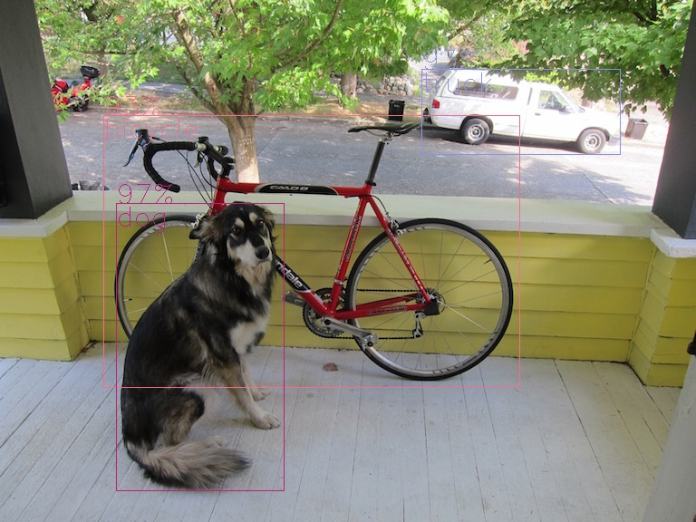
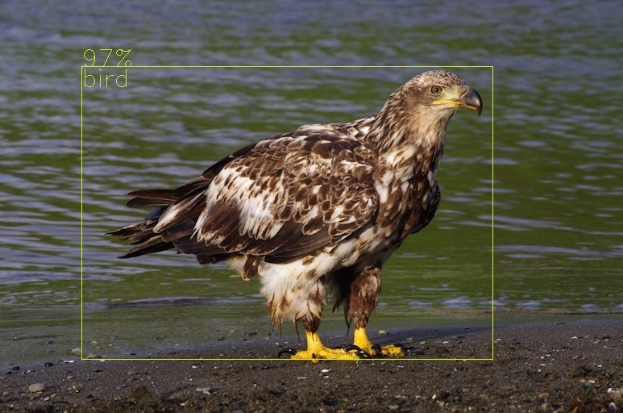
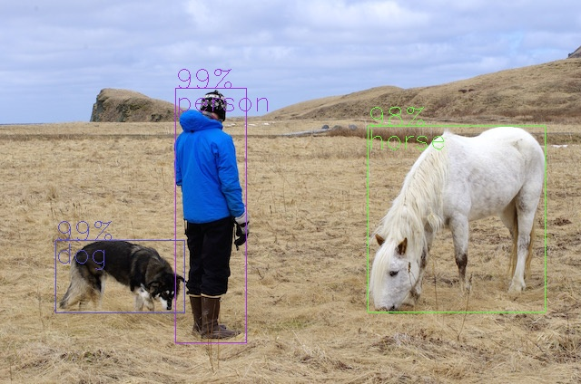
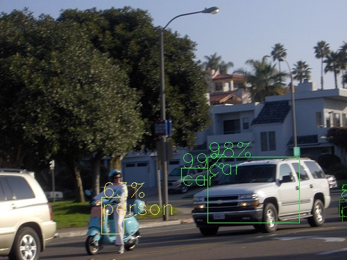
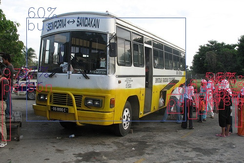
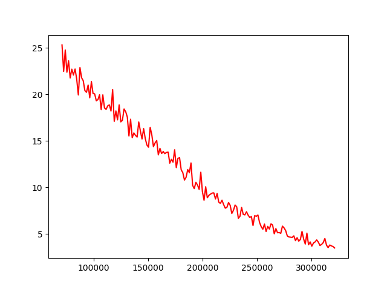

# YOLOv4_tensorflow | [English introductions](README.md)
* yolov4的纯tensorflow实现.
* 实现了tf.data数据加载
</br>

* rdc01234@163.com

## 使用说明
* 执行命令
```
python val_voc.py
```
* 如果没有报错, 就没问题

## 转换 yolov4.weights
* 参考[这个权重转换文件](https://github.com/wizyoung/YOLOv3_TensorFlow/blob/master/convert_weight.py), 我将 yolov4.weights 转换到了自己的代码中
* [yolov4.weights百度云链接](https://pan.baidu.com/s/1VnX5lWT4CkHyqq0JQSllmA) 提取码: wm1j
* **将下载好的 yolov4.weights 放到 yolo_weights 文件夹下, 执行命令**
```
python convert_weight.py
python test_yolo_weights.py
```
* 会在 yolo_weights 文件夹下生成 ckpt 权重文件(百度网盘里面有权重文件)
* 并且你将会看到这样的画面,完美



* weights_name.txt 文件中存放的是图模型的卷积层和bn的名字

## 在 VOC2007 和 VOC2012 数据集上训练
* 打开 config.py ,将 voc_root_dir 修改为自己VOC数据集存放的根目录
* 文件夹就这么放
```
path_to_voc_root_dir
        voc_dir_ls[0] (VOC_2007)
        |       |Annotations
        |       |JPEGImages
        |       |...
        voc_dir_ls[1] (VOC_2012)
        |        |Annotations
        |        |JPEGImages
        |        |...
        others_folder_name
```
* 执行命令
```
python train_voc.py
```
* 训练完成后,将测试图片放到 voc_test_pic 文件夹下,执行命令
```
python val_voc.py
```
* 训练一天(364999步)的结果(input_size:416*416, batch_size:2, lr:2e-4, optimizer:momentum)，还不错


* **所有的配置参数都在 config.py 中，你可以按照自己的实际情况来修改**
* 这是我训练的损失图，学习率貌似有点太小了
```
python show_loss.py 20 300
```


## 使用tf.data在 VOC2007 和 VOC2012 数据集上训练
* 和**在 VOC2007 和 VOC2012 数据集上训练**一样，不过执行这一个训练文件
```
train_voc_tf_data.py
```

## 在自己的数据集上训练
* **于2021年1月5日删除了训练自己数据集的相关代码，如果需要训练自己的数据集，对src/Data_voc.py的__init_args函数稍加修改就可以了**
* 

## 将 ckpt 模型转换为 pb 模型
* 打开ckpt2pb.py 文件, 修改里面的 'ckpt_file_dir', "class_num", "anchors"参数，执行命令
```
python ckpt2pb.py
```
* 在 'ckpt_file_dir' 目录下会看到生成的 pb 模型
* 执行命令
```
python val_pb.py
```
* 就会看到pb模型的检测效果
* **[yolov4.weights的pb模型及ckpt模型链接](https://pan.baidu.com/s/1VnX5lWT4CkHyqq0JQSllmA) 提取码: wm1j**

## 有关 config.py 和训练的提示
1. config.py 中的 width 和 height 应该是 608，显存不够才调整为 416 的
2. 其实可以将激活函数设置为leaky_relu, 可以节省很多的显存用于增大batch_size(2->4)
3. 学习率不宜设置太高
4. 如果出现NAN的情况，请降低学习率

## 我的设备
GPU : 1660ti (华硕猛禽) 6G</br>
CPU : i5 9400f</br>
mem : 16GB</br>
os  : ubuntu 18.04</br>
cuda: 10.2</br>
cudnn : 7</br>
python : 3.6.9</br>
tensorflow-gpu:1.14.0</br>
numpy : 1.18.1</br>
opencv-python : 4.1.2.30</br>
